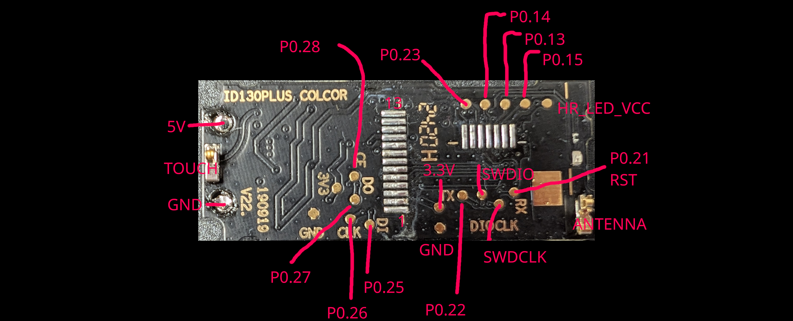

# ID130C Fitness Band Documentation

There are many identical looking bands from the both the same and different manufacturers.  The information here is for a specific band.  You know if you have the right band.  It's unlikely this informtion will apply to any other bands, things like the schematic vary wildly.

## Firmware upgrader

The supplied firmware is fine but we don't have the source code and that's no fun.  What we do have is a open source upgrader that will replace the firmware with the Nordic Semiconductor SDK 17.1 secure bootloader example.  The source for the upgrader is contained in a submodule of this repo and is built and published by actions in this repo.  The "private" key for the bootloader is public in this repo.  It's not in our scope to offer different keys for different people, if you're concerned about other people overwriting your firmware then you'll need to work out how to replace the bootloader yourself.

You can find the upgrader in the releases of this repo.  The process to update the firmware is shown in at youtube video at https://www.youtube.com/watch?v=V8OpACNXLPM

Note that there is no power management in the updated firmware so it will quickly run the battery down so keep it plugged into USB.  There is also no display support, watch the video for more.

## Hardware

We are trying to put as much detail about the hardware as we can in this repo.  If you are missing some information you need please log an issue and we'll try to get to it.

### Dismantling

There is a youtube video at showing the process to cut a band open.  Please watch the video carefully and don't attempt this if you're not experienced with a dremel tool.  The video is at https://youtu.be/yi4o7kRTbUk?si=P2wgrHXKDYIMfqZv

### Connecting to the PCB

Now that you have extracted the PCB from the housing you can use this image to connect to the board.  Given this battery operated it is on all the time.  Consider disconnecting the battery before soldering for safety reasons.  You can connect a CMIS-DAP Arm debugger using 3.3v, SWDCLK, SWDIO and GND.  If you attach the debugger before upgrading you'll find the APPPROTECT is enabled and the debugger can't connect.  You can fix this by erasing the device.  Yes APPPROTECT can be bypassed, that is outside the scope of this project.

- 

### Pins

There is a header file detailing the pins used by the various peripherals in the [include](../include) directory.

### Schematic

There is a rough kicad schematic in [id130c](id130c) you can see a pdf at [id130c.kicad_sch.pdf](id130c/id130c.kicad_sch.pdf).

